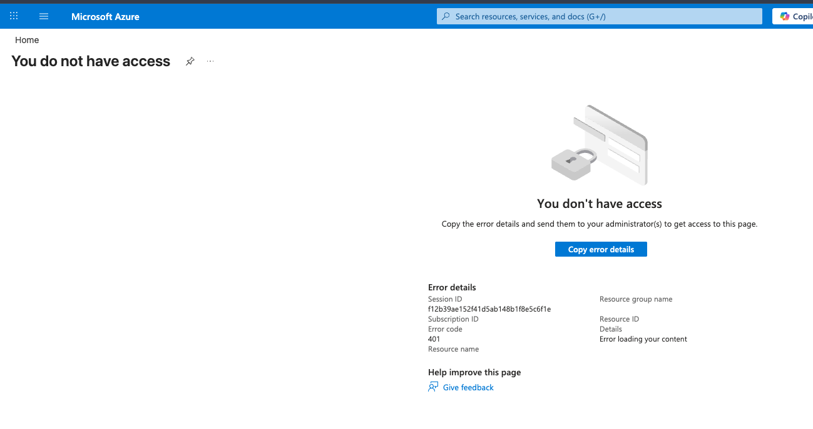
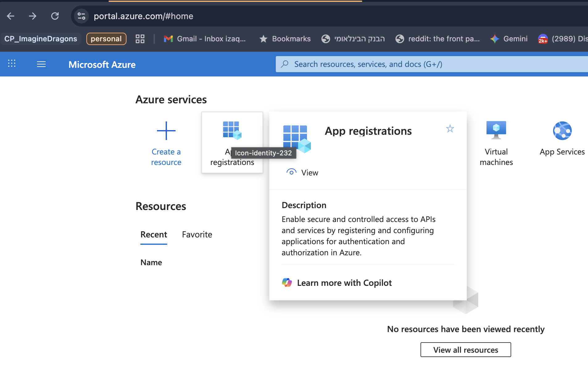

# Microsoft Outlook & Teams MCP Integration

## Status: BLOCKED - No Azure Portal Access

**Current Blocker:** You don't have access to Azure Portal to create app registrations.



**Next Step:** Request Azure Portal access OR ask admin to create the app for you (see `ADMIN_ACCESS_REQUEST.md`)

---

## Manual Setup Tasks (Your Actions)

### ⏸️ Step 0: Get Azure Portal Access (BLOCKED)



**Issue:** You don't have access to Azure Portal (Error 401)

**Options:**
- [ ] Option A: Request Azure Portal access from admin (see `ADMIN_ACCESS_REQUEST.md` - Option 1)
- [ ] Option B: Ask admin to create the app for you (see `ADMIN_ACCESS_REQUEST.md` - Option 2)

**Recommended:** Option B (faster - admin creates app and sends you the Client ID)

### ⏳ Step 1: Azure AD App Registration (WAITING)

**If admin creates it for you, they need to:**
- [ ] Create app registration named "microsoft-mcp"
- [ ] Set "Allow public client flows" to Yes
- [ ] Add Microsoft Graph API permissions:
  - Mail.ReadWrite
  - Calendars.ReadWrite
  - Files.ReadWrite
  - Contacts.Read
  - People.Read
  - User.Read
- [ ] Grant admin consent for permissions
- [ ] Send you the Application (client) ID

**Application (client) ID:** `_________________` (admin will provide this)

### ⏳ Step 2: Authenticate Microsoft Account (WAITING)
**Prerequisites:** Admin approval must be completed first

```bash
# Install uv if needed
curl -LsSf https://astral.sh/uv/install.sh | sh

# Clone the MCP server
cd ~/work/git
git clone https://github.com/elyxlz/microsoft-mcp.git
cd microsoft-mcp

# Run authentication
export MICROSOFT_MCP_CLIENT_ID="your-app-id-here"
uv run authenticate.py
```

Follow prompts:
- [ ] Device code displayed
- [ ] Open URL in browser
- [ ] Enter code and sign in
- [ ] Grant permissions
- [ ] Verify tokens saved to `~/.microsoft_mcp_token_cache.json`

### ⏳ Step 3: Add Microsoft MCP to Cursor Config (WAITING)

Edit `~/.cursor/mcp.json`:

```json
{
  "mcpServers": {
    "github": { ... },
    "slack": { ... },
    "perimeter81-atlassian": { ... },
    "microsoft": {
      "command": "uvx",
      "args": ["--from", "git+https://github.com/elyxlz/microsoft-mcp.git", "microsoft-mcp"],
      "env": {
        "MICROSOFT_MCP_CLIENT_ID": "your-app-id-here",
        "PATH": "/opt/homebrew/bin:/opt/homebrew/sbin:/usr/local/bin:/usr/bin:/bin:/usr/sbin:/sbin"
      }
    }
  }
}
```

### ⏳ Step 4: Restart Cursor and Verify (WAITING)
- [ ] Quit Cursor completely (Cmd+Q)
- [ ] Reopen Cursor
- [ ] Go to Settings → MCP Servers
- [ ] Verify "microsoft" appears in the list
- [ ] Test: Ask AI to "List my recent emails"

---

## Code Changes (AI Agent Tasks)

### 🤖 Step 5: Create Microsoft Validator
**File:** `src/mcp_health/validators/microsoft.py`

Create validator for Microsoft Graph API tokens:
- Validate token via Graph API `/me` endpoint
- Support OAuth 2.0 token refresh
- Handle multi-account scenarios
- Detect token expiration

### 🤖 Step 6: Update Validator Exports
**File:** `src/mcp_health/validators/__init__.py`

Add MicrosoftValidator to exports.

### 🤖 Step 7: Add Microsoft Detection Logic
**File:** `src/mcp_health/cli.py`

Add detection for Microsoft MCP servers:
- Detect `MICROSOFT_MCP_CLIENT_ID` env var
- Support token cache file validation
- Add to health check flow

### 🤖 Step 8: Update Documentation
**File:** `README.md`

Add Microsoft service documentation:
- Configuration example
- Token validation details
- Refresh behavior (OAuth auto-refresh)
- Troubleshooting section

### 🤖 Step 9: Add Unit Tests
**File:** `tests/unit/test_validators.py`

Add test cases for MicrosoftValidator:
- Valid token test
- Expired token test
- Missing token test
- Network error handling

---

## What This Enables

| Service | Capabilities |
|---------|-------------|
| **Outlook** | Read, send, reply, manage emails, folders, attachments |
| **Calendar** | Create/update events, check availability, respond to invites |
| **OneDrive** | Upload, download, search files |
| **Contacts** | Search and list contacts |

---

## Alternative: Personal Microsoft Account (No Admin Needed)

If admin approval is taking too long, you can create a separate app registration using a personal Microsoft account:

1. Use a personal Microsoft account (e.g., @outlook.com, @hotmail.com)
2. Create app registration at https://portal.azure.com
3. Set tenant ID to `consumers` for personal accounts only:
   ```bash
   export MICROSOFT_MCP_TENANT_ID=consumers
   ```

**Limitations:**
- Only works with personal Microsoft accounts
- Won't access work/school email and calendar

---

## Notes

- **MCP Server:** Using `elyxlz/microsoft-mcp` (Python-based, 38 stars on GitHub)
- **Authentication:** Device code flow (no client secret needed)
- **Token Storage:** `~/.microsoft_mcp_token_cache.json`
- **Token Type:** OAuth 2.0 (auto-refreshable)

---

## Troubleshooting

### "Need admin approval" error
- This is expected for work/school accounts
- Request admin consent (see Step 1b)
- Alternative: Use personal Microsoft account with `MICROSOFT_MCP_TENANT_ID=consumers`

### Authentication fails after approval
```bash
# Clear token cache and re-authenticate
rm ~/.microsoft_mcp_token_cache.json
cd ~/work/git/microsoft-mcp
export MICROSOFT_MCP_CLIENT_ID="your-app-id"
uv run authenticate.py
```

### Cursor doesn't see the MCP server
- Verify `uvx` is in PATH
- Check Cursor logs: Help → Show Logs → Extension Host
- Restart Cursor completely

---

**Last Updated:** 2026-01-28
**Status:** Blocked on admin approval for Azure AD app permissions
