# Documentation Map - Order Processing System

## 📚 Document Relationships

```mermaid
graph TB
    README[📖 README.md<br/>Quick Start & Overview]
    DESIGN[🏗️ SYSTEM_DESIGN.md<br/>Architecture & Decisions]
    IMPL[🚀 IMPLEMENTATION_SUMMARY.md<br/>Features & Implementation]
    DEMO[🎯 demo/curl-examples.md<br/>API Testing Guide]
    
    README --> DESIGN
    README --> IMPL
    README --> DEMO
    
    DESIGN --> IMPL
    DESIGN --> README
    
    IMPL --> README
    IMPL --> DESIGN
    IMPL --> DEMO
    
    DEMO --> README
    DEMO --> IMPL
    
    README -.-> |"Quick Setup"| START[🚀 ./scripts/start-services.sh]
    README -.-> |"Demo"| RUN[🎯 ./demo/demo.sh]
    
    style README fill:#e1f5fe
    style DESIGN fill:#f3e5f5
    style IMPL fill:#e8f5e8
    style DEMO fill:#fff3e0
```

## 📖 Document Purpose & Audience

### [README.md](README.md) - Entry Point
**Purpose**: Quick start and project overview  
**Audience**: New developers, project managers, anyone getting started  
**Key Content**:
- Project overview and features
- Quick setup instructions
- Basic architecture summary
- Technology stack overview
- Links to detailed documentation

### [SYSTEM_DESIGN.md](SYSTEM_DESIGN.md) - Architecture Deep Dive
**Purpose**: Complete architectural decisions and design rationale  
**Audience**: System architects, senior developers, technical reviewers  
**Key Content**:
- Detailed architecture with diagrams
- Technology choice justifications
- Non-functional requirements
- Design trade-offs and decisions
- Production considerations

### [IMPLEMENTATION_SUMMARY.md](IMPLEMENTATION_SUMMARY.md) - Implementation Guide
**Purpose**: Detailed implementation features and usage  
**Audience**: Developers, testers, DevOps engineers  
**Key Content**:
- Complete feature list
- API documentation
- Database schema
- Configuration details
- Testing and monitoring

### [demo/curl-examples.md](demo/curl-examples.md) - API Testing
**Purpose**: Hands-on API testing and examples  
**Audience**: Developers, QA engineers, API consumers  
**Key Content**:
- Complete API examples
- Authentication flows
- Error scenarios
- Load testing examples

## 🔄 Navigation Flow

### For New Users
1. **Start**: [README.md](README.md) - Get overview and quick setup
2. **Understand**: [SYSTEM_DESIGN.md](SYSTEM_DESIGN.md) - Learn architecture
3. **Implement**: [IMPLEMENTATION_SUMMARY.md](IMPLEMENTATION_SUMMARY.md) - Detailed features
4. **Test**: [demo/curl-examples.md](demo/curl-examples.md) - Try the APIs

### For Architects
1. **Design**: [SYSTEM_DESIGN.md](SYSTEM_DESIGN.md) - Architecture decisions
2. **Validate**: [IMPLEMENTATION_SUMMARY.md](IMPLEMENTATION_SUMMARY.md) - Implementation proof
3. **Demo**: [README.md](README.md) - Quick demo setup

### For Developers
1. **Setup**: [README.md](README.md) - Quick start
2. **Code**: [IMPLEMENTATION_SUMMARY.md](IMPLEMENTATION_SUMMARY.md) - Implementation details
3. **Test**: [demo/curl-examples.md](demo/curl-examples.md) - API testing
4. **Understand**: [SYSTEM_DESIGN.md](SYSTEM_DESIGN.md) - Design context

## 🎯 Quick Actions

| I want to... | Start with... | Then read... |
|---------------|---------------|--------------|
| **Get started quickly** | [README.md](README.md) | [demo/curl-examples.md](demo/curl-examples.md) |
| **Understand the architecture** | [SYSTEM_DESIGN.md](SYSTEM_DESIGN.md) | [IMPLEMENTATION_SUMMARY.md](IMPLEMENTATION_SUMMARY.md) |
| **See all features** | [IMPLEMENTATION_SUMMARY.md](IMPLEMENTATION_SUMMARY.md) | [README.md](README.md) |
| **Test the APIs** | [demo/curl-examples.md](demo/curl-examples.md) | [IMPLEMENTATION_SUMMARY.md](IMPLEMENTATION_SUMMARY.md) |
| **Run a demo** | [README.md](README.md) → `./demo/demo.sh` | [IMPLEMENTATION_SUMMARY.md](IMPLEMENTATION_SUMMARY.md) |

## 🔗 Cross-References Summary

### From README.md
- → [SYSTEM_DESIGN.md](SYSTEM_DESIGN.md) for architecture details
- → [IMPLEMENTATION_SUMMARY.md](IMPLEMENTATION_SUMMARY.md) for implementation details
- → [demo/curl-examples.md](demo/curl-examples.md) for API testing

### From SYSTEM_DESIGN.md
- → [README.md](README.md) for quick start
- → [IMPLEMENTATION_SUMMARY.md](IMPLEMENTATION_SUMMARY.md) for implementation proof
- → [demo/curl-examples.md](demo/curl-examples.md) for live testing

### From IMPLEMENTATION_SUMMARY.md
- → [README.md](README.md) for overview and setup
- → [SYSTEM_DESIGN.md](SYSTEM_DESIGN.md) for design rationale
- → [demo/curl-examples.md](demo/curl-examples.md) for API examples

This interconnected documentation ensures that readers can easily navigate between different levels of detail and find the information they need for their specific role and use case. 