# Reliability & Eventual Consistency Design

## Overview

This document defines how our e-commerce system handles service failures and achieves eventual consistency, ensuring no data loss and automatic recovery.

## Failure Scenarios & Recovery Mechanisms

### 1. Delivery Service Down

**Scenario**: Delivery API is unavailable during order processing

```typescript
// Current Behavior with Circuit Breaker
async function createOrder(orderData: any) {
  try {
    // 1. Create order in Sales DB (ALWAYS succeeds)
    const order = await database.createOrder({
      ...orderData,
      status: 'PENDING_SHIPMENT'
    });

    // 2. Try to initiate delivery
    try {
      const delivery = await deliveryServiceClient.initiateDelivery(order);
      await database.updateOrder(order.id, { deliveryId: delivery.id });
    } catch (deliveryError) {
      // 3. Circuit breaker opens, but order is already created
      logger.warn('Delivery initiation failed, will retry via background job', {
        orderId: order.id,
        error: deliveryError.message
      });
      
      // 4. Queue for retry (eventual consistency mechanism)
      await eventPublisher.publishEvent('DELIVERY_INITIATION_FAILED', {
        orderId: order.id,
        retryAfter: new Date(Date.now() + 60000), // Retry in 1 minute
        attempt: 1
      });
    }

    return order; // Customer gets order ID immediately
  } catch (error) {
    // Database failure - this is the only case where order creation fails
    throw error;
  }
}
```

**Recovery Mechanism**:
- ✅ **Order Created**: Customer has order ID immediately
- 🔄 **Background Retry**: Delivery initiation retried every 1-5 minutes
- ⏱️ **Recovery Time**: 1-30 minutes (depending on service recovery)

### 2. Product Service Down

**Scenario**: Product availability check fails

```typescript
// Current Behavior with Fallback
async function checkProductAvailability(productIds: string[]) {
  try {
    return await productServiceClient.checkAvailability(productIds);
  } catch (error) {
    // Circuit breaker fallback
    logger.warn('Product service down, using fallback availability', {
      productIds,
      error: error.message
    });

    // Fallback: Assume available but flag for manual review
    const fallbackResponse = productIds.map(productId => ({
      productId,
      available: true,
      quantity: 1,
      requiresManualReview: true,
      fallbackUsed: true
    }));

    // Queue for reconciliation when service recovers
    await eventPublisher.publishEvent('AVAILABILITY_CHECK_FALLBACK_USED', {
      productIds,
      fallbackResponse,
      timestamp: new Date()
    });

    return fallbackResponse;
  }
}
```

**Recovery Mechanism**:
- ✅ **Order Proceeds**: With manual review flag
- 🔄 **Background Reconciliation**: Verify availability when service recovers
- ⚠️ **Manual Intervention**: Staff reviews flagged orders
- ⏱️ **Recovery Time**: 5-60 minutes + manual review time

### 3. SQS/SNS Down

**Scenario**: AWS messaging services unavailable

```typescript
class EventPublisher {
  async publishEvent(eventType: string, eventData: any): Promise<void> {
    try {
      await this.circuitBreaker.fire(eventMessage);
    } catch (error) {
      // SQS/SNS is down - use outbox pattern
      logger.error('Event publishing failed, storing in outbox', {
        eventType,
        error: error.message
      });

      // Store in local database outbox table
      await this.storeInOutbox({
        eventType,
        eventData,
        status: 'PENDING',
        createdAt: new Date(),
        retryCount: 0
      });
    }
  }

  // Background job processes outbox when SQS recovers
  async processOutboxEvents(): Promise<void> {
    const pendingEvents = await database.getOutboxEvents({ 
      status: 'PENDING',
      retryCount: { lt: 5 }
    });

    for (const event of pendingEvents) {
      try {
        await this.sns.publish(event.payload).promise();
        await database.updateOutboxEvent(event.id, { 
          status: 'SENT',
          sentAt: new Date()
        });
      } catch (error) {
        await database.updateOutboxEvent(event.id, {
          retryCount: event.retryCount + 1,
          lastError: error.message
        });
      }
    }
  }
}
```

**Recovery Mechanism**:
- ✅ **Local Storage**: Events stored in database outbox
- 🔄 **Background Processing**: Outbox processed every 30 seconds
- ⏱️ **Recovery Time**: 30 seconds - 5 minutes after SQS recovery

### 4. Database Down

**Scenario**: PostgreSQL database unavailable

```typescript
class DatabaseService {
  async executeWithCircuitBreaker<T>(operation: () => Promise<T>): Promise<T> {
    try {
      return await this.circuitBreaker.fire(operation);
    } catch (error) {
      if (this.isConnectionError(error)) {
        // Database is down - this is critical failure
        logger.error('Database unavailable - rejecting request', {
          error: error.message,
          circuitState: this.circuitBreaker.opened ? 'OPEN' : 'CLOSED'
        });
        
        throw new ServiceUnavailableError('System temporarily unavailable');
      }
      throw error;
    }
  }
}

// API Response when database is down
app.use(ErrorHandlingMiddleware.handle());
// Returns: 503 Service Unavailable - System temporarily unavailable
```

**Recovery Mechanism**:
- ❌ **Immediate Failure**: Cannot proceed without database
- 🔄 **Circuit Breaker**: Prevents cascade failures
- ⏱️ **Recovery Time**: Immediate when database recovers (circuit breaker resets in 20s)

## Eventual Consistency Patterns

### 1. Outbox Pattern

**Database Schema**:
```sql
CREATE TABLE outbox_events (
  id UUID PRIMARY KEY DEFAULT gen_random_uuid(),
  event_type VARCHAR(100) NOT NULL,
  event_data JSONB NOT NULL,
  status VARCHAR(20) DEFAULT 'PENDING', -- PENDING, SENT, FAILED
  created_at TIMESTAMP DEFAULT CURRENT_TIMESTAMP,
  sent_at TIMESTAMP,
  retry_count INTEGER DEFAULT 0,
  last_error TEXT
);

CREATE INDEX idx_outbox_pending ON outbox_events(status, created_at) 
WHERE status = 'PENDING';
```

**Implementation**:
```typescript
// Transactional outbox - ensures atomicity
async function createOrderWithEvents(orderData: any): Promise<Order> {
  return await database.transaction(async (tx) => {
    // 1. Create order
    const order = await tx.order.create({ data: orderData });
    
    // 2. Store events in outbox (same transaction)
    await tx.outboxEvent.create({
      data: {
        eventType: 'ORDER_CREATED',
        eventData: { orderId: order.id, customerId: order.customerId },
        status: 'PENDING'
      }
    });

    return order;
  });
}
```

### 2. Saga Pattern for Complex Workflows

**Order Processing Saga**:
```typescript
class OrderProcessingSaga {
  async execute(orderData: any): Promise<void> {
    const sagaId = `order-saga-${orderData.orderId}`;
    
    try {
      // Step 1: Check availability
      const availability = await this.checkAvailability(orderData.products);
      await this.recordSagaStep(sagaId, 'AVAILABILITY_CHECKED', availability);
      
      // Step 2: Create order
      const order = await this.createOrder(orderData);
      await this.recordSagaStep(sagaId, 'ORDER_CREATED', order);
      
      // Step 3: Initiate delivery
      const delivery = await this.initiateDelivery(order);
      await this.recordSagaStep(sagaId, 'DELIVERY_INITIATED', delivery);
      
      // Step 4: Mark saga complete
      await this.completeSaga(sagaId);
      
    } catch (error) {
      // Compensation logic
      await this.compensate(sagaId, error);
    }
  }

  async compensate(sagaId: string, error: Error): Promise<void> {
    const steps = await this.getSagaSteps(sagaId);
    
    // Reverse order compensation
    for (const step of steps.reverse()) {
      switch (step.action) {
        case 'ORDER_CREATED':
          await this.cancelOrder(step.data.orderId);
          break;
        case 'DELIVERY_INITIATED':
          await this.cancelDelivery(step.data.deliveryId);
          break;
      }
    }
  }
}
```

### 3. Reconciliation Jobs

**Data Consistency Reconciliation**:
```typescript
class ReconciliationService {
  // Runs every 5 minutes
  async reconcileOrderStatuses(): Promise<void> {
    const inconsistentOrders = await this.findInconsistentOrders();
    
    for (const order of inconsistentOrders) {
      try {
        // Get authoritative status from delivery service
        const deliveryStatus = await deliveryService.getDeliveryStatus(order.deliveryId);
        const expectedOrderStatus = StatusMappingService.mapDeliveryToSalesStatus(deliveryStatus);
        
        if (order.status !== expectedOrderStatus) {
          logger.warn('Order status inconsistency detected', {
            orderId: order.id,
            currentStatus: order.status,
            expectedStatus: expectedOrderStatus
          });
          
          // Auto-correct if valid transition
          if (StatusMappingService.isValidTransition(order.status, expectedOrderStatus)) {
            await this.updateOrderStatus(order.id, expectedOrderStatus);
            logger.info('Order status reconciled', { orderId: order.id });
          } else {
            // Flag for manual review
            await this.flagForManualReview(order.id, 'Invalid status transition');
          }
        }
      } catch (error) {
        logger.error('Reconciliation failed for order', {
          orderId: order.id,
          error: error.message
        });
      }
    }
  }

  async findInconsistentOrders(): Promise<Order[]> {
    // Find orders with:
    // 1. Status not updated in last 24 hours
    // 2. Delivery ID but no recent status updates
    // 3. Manual review flags
    return database.order.findMany({
      where: {
        OR: [
          {
            status: 'PENDING_SHIPMENT',
            createdAt: { lt: new Date(Date.now() - 24 * 60 * 60 * 1000) }
          },
          {
            requiresManualReview: true
          }
        ]
      }
    });
  }
}
```

## Recovery Time Estimates

### Service Recovery Times

| Failure Type | Detection Time | Recovery Time | Total Downtime |
|--------------|----------------|---------------|----------------|
| **Delivery Service** | 5-10 seconds | 1-30 minutes | 1-30 minutes |
| **Product Service** | 5-10 seconds | 5-60 minutes* | 5-60 minutes |
| **SQS/SNS** | 10-30 seconds | 30s-5 minutes | 30s-5 minutes |
| **Database** | 2-5 seconds | Immediate** | 20-30 seconds |
| **Network Issues** | 5-15 seconds | Variable | Variable |

*Product service downtime leads to manual review process  
**Database recovery is immediate once service is restored (circuit breaker reset)

### Circuit Breaker Recovery

```typescript
// Circuit breaker configuration for different services
const circuitBreakerConfigs = {
  'delivery-service': {
    errorThresholdPercentage: 40,  // More sensitive
    resetTimeout: 60000,           // 1 minute
    volumeThreshold: 5
  },
  'product-service': {
    errorThresholdPercentage: 50,  // Balanced
    resetTimeout: 30000,           // 30 seconds
    volumeThreshold: 10
  },
  'database': {
    errorThresholdPercentage: 60,  // Less sensitive
    resetTimeout: 20000,           // 20 seconds
    volumeThreshold: 10
  }
};
```

## Monitoring & Alerting

### Key Metrics

```typescript
interface ReliabilityMetrics {
  circuitBreakerStates: Record<string, 'OPEN' | 'CLOSED' | 'HALF_OPEN'>;
  outboxEventsPending: number;
  reconciliationJobsStatus: 'HEALTHY' | 'DEGRADED' | 'FAILED';
  failedEventCount: number;
  manualReviewQueueLength: number;
}

class ReliabilityMonitor {
  async getHealthMetrics(): Promise<ReliabilityMetrics> {
    return {
      circuitBreakerStates: CircuitBreakerFactory.getMetrics(),
      outboxEventsPending: await this.countPendingOutboxEvents(),
      reconciliationJobsStatus: await this.getReconciliationStatus(),
      failedEventCount: await this.countFailedEvents(),
      manualReviewQueueLength: await this.countManualReviewItems()
    };
  }

  // Alert thresholds
  async checkAlerts(): Promise<void> {
    const metrics = await this.getHealthMetrics();
    
    // Circuit breaker alerts
    const openCircuits = Object.entries(metrics.circuitBreakerStates)
      .filter(([_, state]) => state === 'OPEN');
    
    if (openCircuits.length > 0) {
      await this.sendAlert('CIRCUIT_BREAKER_OPEN', {
        services: openCircuits.map(([service]) => service)
      });
    }

    // Outbox backlog alert
    if (metrics.outboxEventsPending > 100) {
      await this.sendAlert('OUTBOX_BACKLOG', {
        pendingCount: metrics.outboxEventsPending
      });
    }

    // Manual review queue alert
    if (metrics.manualReviewQueueLength > 50) {
      await this.sendAlert('MANUAL_REVIEW_BACKLOG', {
        queueLength: metrics.manualReviewQueueLength
      });
    }
  }
}
```

## Summary: Eventual Consistency Guarantees

### ✅ What We Guarantee

1. **No Data Loss**: Outbox pattern ensures events are persisted
2. **Order Integrity**: Orders are created even if downstream services fail
3. **Automatic Recovery**: Background jobs restore consistency
4. **Manual Oversight**: Human review for ambiguous cases

### ⏱️ Recovery Time Summary

- **Best Case**: 20-30 seconds (circuit breaker reset)
- **Typical Case**: 1-5 minutes (service recovery + reconciliation)
- **Worst Case**: 5-60 minutes + manual review time

### 🔄 Consistency Model

- **Eventually Consistent**: All services will reach consistent state
- **Recovery Mechanisms**: Outbox, saga compensation, reconciliation jobs
- **Human Fallback**: Manual review for edge cases

This design ensures that **transient failures are tolerated** and **eventual consistency is achieved** through multiple overlapping mechanisms, providing robust reliability for the e-commerce system.

## Architecture Diagrams

### Order Processing Flow with Reliability Mechanisms

```mermaid
graph TB
    C[Customer] -->|1. Create Order| SA[Sales API]
    
    subgraph "Order Processing Flow with Reliability"
        SA -->|2. Check Availability| CB1{Circuit Breaker<br/>Product Service}
        CB1 -->|Open/Fail| F1[Fallback: Assume Available<br/>+ Flag for Manual Review]
        CB1 -->|Closed/Success| PS[Product Service]
        PS -->|Available| SA
        F1 -->|Continue with Flag| SA
        
        SA -->|3. Create Order| DB[(Sales Database)]
        DB -->|Order ID: ORD-123| SA
        
        SA -->|4. Initiate Delivery| CB2{Circuit Breaker<br/>Delivery Service}
        CB2 -->|Open/Fail| OB[Store in Outbox<br/>Retry Background Job]
        CB2 -->|Closed/Success| DS[Delivery Service]
        DS -->|Delivery ID| SA
        
        SA -->|5. Publish Events| CB3{Circuit Breaker<br/>SQS/SNS}
        CB3 -->|Open/Fail| OB2[Store in Outbox<br/>Process Later]
        CB3 -->|Closed/Success| SQS[AWS SQS/SNS]
    end
    
    subgraph "Eventual Consistency Mechanisms"
        OB -->|Every 1-5 min| BJ1[Background Job:<br/>Retry Delivery Initiation]
        BJ1 -->|Retry| DS
        
        OB2 -->|Every 30 sec| BJ2[Background Job:<br/>Process Outbox Events]
        BJ2 -->|Retry| SQS
        
        REC[Reconciliation Job<br/>Every 5 minutes] -->|Check Consistency| DB
        REC -->|Get Authoritative Status| DS
        REC -->|Auto-correct/Flag| DB
        
        MR[Manual Review Queue] -->|Process Flagged Orders| STAFF[Operations Staff]
    end
    
    subgraph "Recovery Scenarios"
        subgraph "Delivery Service Down"
            DS1[Delivery Service ❌] -->|Impact| I1["✅ Order Created<br/>🔄 Background Retry<br/>⏱️ 1-30 min recovery"]
        end
        
        subgraph "Product Service Down"
            PS1[Product Service ❌] -->|Impact| I2["✅ Order with Flag<br/>⚠️ Manual Review<br/>⏱️ 5-60 min + review"]
        end
        
        subgraph "SQS/SNS Down"
            SQS1[SQS/SNS ❌] -->|Impact| I3["✅ Events in Outbox<br/>🔄 Background Process<br/>⏱️ 30s-5 min recovery"]
        end
        
        subgraph "Database Down"
            DB1[Database ❌] -->|Impact| I4["❌ Order Creation Fails<br/>🔄 Circuit Breaker<br/>⏱️ 20-30s recovery"]
        end
    end
    
    SA -->|Return Order ID| C
    
    classDef serviceDown fill:#ffcccc,stroke:#cc0000,stroke-width:2px
    classDef reliability fill:#ccffcc,stroke:#00cc00,stroke-width:2px
    classDef outbox fill:#ffffcc,stroke:#cccc00,stroke-width:2px
    
    class DS1,PS1,SQS1,DB1 serviceDown
    class CB1,CB2,CB3,BJ1,BJ2,REC reliability
    class OB,OB2 outbox
```



### Recovery Timeline and Failure Impact Analysis

```mermaid
graph LR
    subgraph "Recovery Timeline (seconds)"
        T0[T+0s<br/>Failure Detected] 
        T5[T+5s<br/>Circuit Breaker Opens]
        T20[T+20s<br/>Database Recovery]
        T30[T+30s<br/>First Outbox Retry]
        T60[T+60s<br/>First Delivery Retry]
        T300[T+300s<br/>Typical Service Recovery]
        T3600[T+3600s<br/>Manual Review SLA]
    end
    
    subgraph "Failure Scenarios & Recovery Times"
        subgraph "Database Down"
            DB_FAIL[Database Failure] -->|2-5s| DB_DETECT[Detection]
            DB_DETECT -->|20s| DB_RECOVER[Recovery Complete]
            DB_RECOVER -->|Impact| DB_RESULT["❌ Immediate Failure<br/>⏱️ 20-30s total"]
        end
        
        subgraph "SQS/SNS Down"
            SQS_FAIL[SQS/SNS Failure] -->|10-30s| SQS_DETECT[Detection]
            SQS_DETECT -->|Store| SQS_OUTBOX[Events in Outbox]
            SQS_OUTBOX -->|30s intervals| SQS_RETRY[Background Processing]
            SQS_RETRY -->|30s-5min| SQS_RECOVER[Recovery Complete]
            SQS_RECOVER -->|Impact| SQS_RESULT["✅ No Data Loss<br/>⏱️ 30s-5min delay"]
        end
        
        subgraph "Delivery Service Down"
            DEL_FAIL[Delivery Service Failure] -->|5-10s| DEL_DETECT[Detection]
            DEL_DETECT -->|Continue| DEL_ORDER[Order Created]
            DEL_ORDER -->|1-5min intervals| DEL_RETRY[Background Retries]
            DEL_RETRY -->|1-30min| DEL_RECOVER[Recovery Complete]
            DEL_RECOVER -->|Impact| DEL_RESULT["✅ Order Saved<br/>⏱️ 1-30min delay"]
        end
        
        subgraph "Product Service Down"
            PROD_FAIL[Product Service Failure] -->|5-10s| PROD_DETECT[Detection]
            PROD_DETECT -->|Fallback| PROD_FLAG[Order with Flag]
            PROD_FLAG -->|Queue| PROD_MANUAL[Manual Review]
            PROD_MANUAL -->|Staff SLA| PROD_RESOLVE[Human Resolution]
            PROD_RESOLVE -->|Impact| PROD_RESULT["✅ Order Proceeds<br/>⚠️ Manual Review<br/>⏱️ 5-60min + review"]
        end
    end
    
    subgraph "Consistency Guarantees"
        G1["🔒 Transactional Outbox<br/>Ensures atomicity"]
        G2["🔄 Background Jobs<br/>Automatic retry/reconciliation"]
        G3["👥 Manual Review<br/>Human oversight for edge cases"]
        G4["📊 Monitoring<br/>Proactive alerting"]
    end
    
    classDef critical fill:#ffcccc,stroke:#cc0000,stroke-width:2px
    classDef warning fill:#fff3cd,stroke:#856404,stroke-width:2px
    classDef success fill:#d4edda,stroke:#155724,stroke-width:2px
    classDef info fill:#cce7ff,stroke:#004085,stroke-width:2px
    
    class DB_RESULT critical
    class PROD_RESULT warning
    class DEL_RESULT,SQS_RESULT success
    class G1,G2,G3,G4 info
``` 

