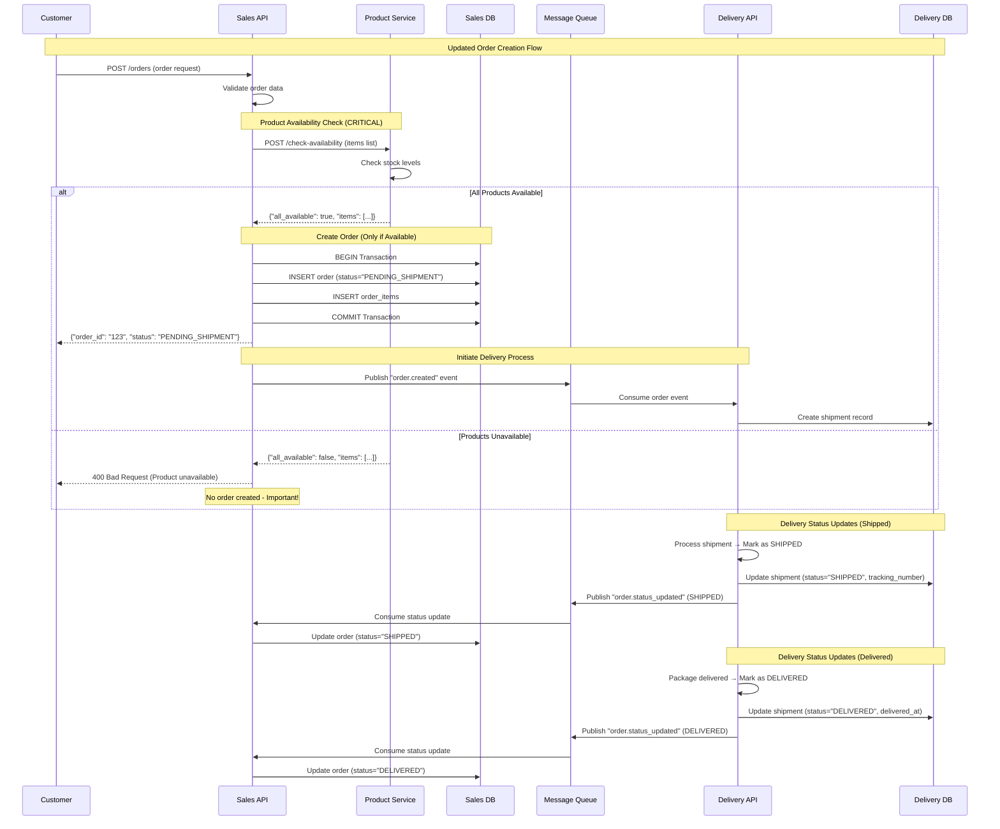

# Order Creation Sequence Diagram

## Complete Order Processing Flow



## Key Flow Points

### 1. Availability Check First
- **Sales API** must check with **Product Service** BEFORE creating any order
- Product Service has final authority on availability
- No order creation happens until availability is confirmed

### 2. Order Creation (Only if Available)
- Order ID generated only after availability confirmation
- Initial status set to "PENDING_SHIPMENT"
- Database transaction ensures data integrity

### 3. Error Handling (Product Unavailable)
- Immediate 400 error response to customer
- **No order record created** in database
- No events published to message queue

### 4. Event-Driven Delivery Process
- Order creation event triggers delivery processing
- Asynchronous status updates flow back to Sales system
- Eventual consistency maintained across services

## Request/Response Examples

### Availability Check Request
```json
POST /api/v1/products/check-availability
{
  "items": [
    {"product_id": "product_456", "quantity": 2},
    {"product_id": "product_789", "quantity": 1}
  ]
}
```

### Success Response (Available)
```json
{
  "all_available": true,
  "items": [
    {"product_id": "product_456", "requested": 2, "available": 150, "is_available": true},
    {"product_id": "product_789", "requested": 1, "available": 50, "is_available": true}
  ]
}
```

### Error Response (Unavailable)
```json
{
  "all_available": false,
  "items": [
    {"product_id": "product_456", "requested": 2, "available": 150, "is_available": true},
    {"product_id": "product_789", "requested": 1, "available": 0, "is_available": false}
  ]
}
```

## Status Update Events

### Order Shipped Event
```json
{
  "event_id": "evt_shipped_123",
  "event_type": "order.status_updated",
  "timestamp": "2024-01-15T14:30:00Z",
  "source": "delivery-service",
  "data": {
    "order_id": "550e8400-e29b-41d4-a716-446655440000",
    "previous_status": "PENDING_SHIPMENT",
    "current_status": "SHIPPED",
    "tracking_number": "TRK123456789",
    "carrier": "FedEx"
  }
}
```

### Order Delivered Event
```json
{
  "event_id": "evt_delivered_123",
  "event_type": "order.status_updated",
  "timestamp": "2024-01-17T16:45:00Z",
  "source": "delivery-service",
  "data": {
    "order_id": "550e8400-e29b-41d4-a716-446655440000",
    "previous_status": "SHIPPED",
    "current_status": "DELIVERED",
    "delivered_at": "2024-01-17T16:45:00Z",
    "delivery_location": "Front door"
  }
}
``` 